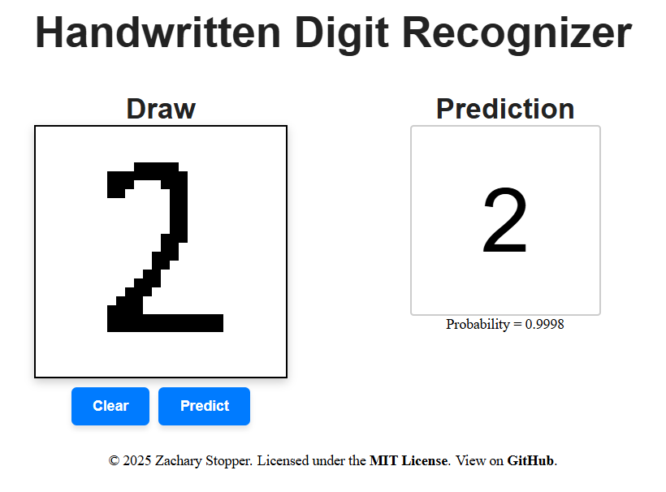

# Digit-Recognizer-Flask-TensorFlow

This web app was developed as a practical and educational project to demonstrate and deepen my understanding of full-stack development and machine learning. The application provided me a way to combine these two skills into a single, functional application. The goal was to create an interactive tool where users can draw handwritten digits and receive real-time predictions using a deep learning model. While the app is not deployed it runs locally and serves as a proof of concept that highlights my understanding of how to build and integrate user interfaces, APIs, and AI models in a cohesive system.

## How It Works

The application runs locally in a Flask development environment. When a user draws a digit (0-9) on the browser-based canvas and requests a prediction, the pixel data is sent to the Flask backend. The server receives the image data and preprocesses it before it is passed to the Convolutional Neural Network (CNN) built using TensorFlow. The network was trained on the MNIST dataset consisting of 60,000 handwritten digits represented by 784-pixel values ranging from 0-255. I simplified the digits to 784-pixel values that are either a 1 or a 0 to match the browser-based canvas. Additionally the data augmented by applying slight zooms, shifts, and rotations to the dataset. This increased the amount of training data. After the user drawing data is passed to the model, a prediction is made and returned to the user interface where it is displayed.

## Installation
To use this project you will need to have python installed. Specifically, a version that supports TensorFlow 2.x. It is recommended that you set up a virtual environment. After this you can clone the repository and install the dependencies using the requirements.txt file. After this you can run app.py to start the Flask developement enviroment. 

## Usage
This webapp is not deployed, so to use it you can run a local Flask development environment. After the app is running you can interact with it on any of the addresses that the Flask app is configured to run on. After going to an address you will be able to draw on a canvas and recieve digit predictions. 

##Takeaways and Future Improvements

This project serves as a solid foundation, however there are several improvements that could be made in the future.
-Deploy the application so that other users can use the application and provide data and feedback
-Allow users to provide feedback when the prediction is incorrect
Retrain the model as additional user data is collected

## Libraries
- Flask
- NumPy
- TensorFlow

